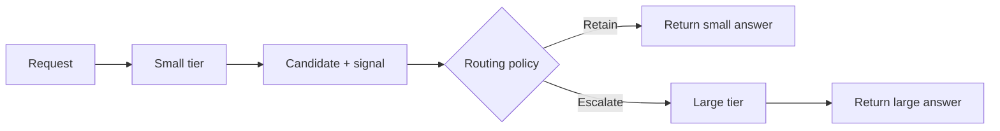

# Model Cascade Playbook

A model cascade sounds simple: let a smaller, cheaper model try first, then
escalate the hard cases. The difficult part is deciding whether the first answer
is good enough — and proving the decision actually saves anything.

Production routers and benchmark suites usually assume a routing policy already
deserves deployment. This playbook is about the step before that: whether the
arithmetic works at all, what a signal has to specify before it can drive a
route, and how to evaluate the whole system rather than one metric.

It is a learning repository, not a production router. Every example is
deterministic, runs offline, and needs no API key, network access, or
third-party packages.

## Does a cascade pay for itself?

Start here, before building a router. A cascade pays for the small attempt and
the routing signal on *every* request — including the ones that escalate and buy
the large-tier answer anyway. That puts a ceiling on how often it can escalate:

```text
rate* = 1 - (small + signal) / large
```

Escalate more often than `rate*` and the cascade costs more than calling the
large tier directly, no matter how accurate the routing is.

```bash
python3 -m examples.cascade_economics \
  --small-cost 0.001 --large-cost 0.010 --signal-cost 0.001 --escalation-rate 0.9
```

```text
overhead per request (small + signal): 0.002
break-even escalation rate: 0.8000
verdict: more expensive than big-only by 0.001 per request
```

There is a second condition, and the escalation rate drops out of it entirely.
Cascade quality is `(1 - rate) * retained + rate * large`, so matching big-only
quality reduces to: **the small answers the policy keeps must be as good as the
large-tier answers it declined to buy.** A signal that retains weaker answers
loses quality at every escalation rate.

Escalate below `rate*`, and keep only what is worth keeping. Most of this
playbook is those two lines and what it takes to satisfy them. The
[decision checklist](docs/decision-checklist.md) works through the rest.

## Watch a routing decision



Run the same prompt with two simulated confidence scores:

```bash
python3 -m examples.minimal_cascade "Explain why routing reasons are useful" --small-confidence 0.9  # retains
python3 -m examples.minimal_cascade "Explain why routing reasons are useful" --small-confidence 0.3  # escalates
```

`--small-confidence` is a score you supply, so you can watch the policy decide
without calling a model. `--threshold` is the cutoff and defaults to an
illustrative — not calibrated — `0.7`. At or above it the policy keeps the small
answer; below it the policy calls the large tier. The `DemoTier` classes only
echo the prompt; a real integration replaces them with adapters implementing
`Tier`.

Missing and malformed scores escalate and record why. Copy
[`examples/signal_contract.toml`](examples/signal_contract.toml) to specify your
own signal, or read the [minimal example](examples/minimal_cascade.py) directly.

## Compare complete policies

The offline [evaluator](examples/evaluate_cascade.py) compares small-only,
big-only, and threshold routing:

```bash
python3 -m examples.evaluate_cascade
```

<details>
<summary>Example output</summary>

```text
policy       quality escalation_rate retained_failures recovered_failures signal variable fixed total reasoning
small-only     0.250           0.000                 3                  0  0.000    0.053 0.500 0.553  included
big-only       0.750           0.000                 0                  0  0.000    0.212 1.500 1.712   unknown
threshold      0.750           0.750                 0                  2  0.012    0.217 2.000 2.229   unknown
pareto policies: small-only, big-only
```

</details>

Here threshold routing recovers two failed small-tier answers, yet reaches
big-only quality at a higher total cost: it pays for the small attempts, the
signal, and both provisioned tiers. That is deliberate — a cascade should have
to beat simple baselines before it earns its complexity.

One fixture is not a law, so a second workload ships alongside it, where routing
does earn its place:

```bash
python3 -m examples.evaluate_cascade --scenario favorable --sweep
```

There the cascade reaches big-only quality for less, and `--sweep` shows quality
and cost across cut points from 0.0 to 1.0 — including the plateau where a
coarse score makes several thresholds the same policy.

To run the comparison on your own numbers, pass a CSV with columns `case_id`,
`small_correct`, `big_correct`, `signal`, `small_cost`, `big_cost`, and
`signal_cost`:

```bash
python3 -m examples.evaluate_cascade --cases your_workload.csv --sweep
```

An empty `signal` cell is a missing signal and anything unparseable is a
malformed one; both escalate, and both still pay their signal cost. The cost
model separates signal, variable, and fixed costs and never invents missing
reasoning usage — see [Account for the whole
system](docs/concepts/evaluation.md#account-for-the-whole-system). The built-in
values are teaching fixtures, not measurements from real models. CSV workloads
default both fixed costs to zero; pass `--small-fixed` and `--big-fixed` to
include provisioning costs. Optional `small_reasoning_included` and
`big_reasoning_included` columns record whether each tier's cost includes
reasoning usage.

## What I learned

**Signals are not free.** Asking a model to rate or critique its answer can add
enough calls, tokens, and latency to erase the savings from routing.

**Confidence is not a policy.** A promising score is not enough on its own. You
still need a threshold chosen before evaluation, uncertainty around the result,
and a clear rule for missing or malformed values.

**Experiment design matters as much as model choice.** Small differences in
prompts, conditions, or accounting can create an apparent result that
disappears when the comparison is corrected.

## What the case study found

The case study is my own research project on cheap escalation signals for code,
testing three signals on 120 selected programming tasks. Its results are a
worked example, not a prediction for other cascades.

- None of the three signals cleared the evidence gate I registered before
  looking. Self-evaluation missed it by 0.0033 — a strong point estimate whose
  lower confidence bound fell short. The signal-driven cascade was therefore
  **untestable, not negative**.
- Syntactic agreement barely varied, and the one-bit critic retained 183 of the
  289 failed answers it existed to catch.
- Two signals needed three extra calls per problem. The third looked free only
  because three model samples had already been generated.
- A prompt-format mismatch invalidated an apparent context effect. After the
  comparison was corrected, only one narrow positive contrast remained.

The broader lesson is that the routing `if` statement is the easy part. A useful
cascade also has to justify its signal, threshold, costs, and evaluation.

Read the full [case study](docs/case-studies/escalation-signals-study.md),
including the [corrected failure-context
evidence](docs/case-studies/escalation-signals-study.md#corrected-failure-context-evidence),
and keep its [limitations](docs/limitations.md) beside the conclusions.

## Read next

- [Cascade basics](docs/concepts/cascade-basics.md) — the moving parts
- [Escalation signals](docs/concepts/escalation-signals.md) — what can drive a route
- [Evaluating a cascade](docs/concepts/evaluation.md) — quality, cost, and uncertainty
- [Latency](docs/concepts/latency.md) — why the mean improves and the tail gets worse
- [Should you cascade?](docs/decision-checklist.md) — the checklist to work through first
- [Case study](docs/case-studies/escalation-signals-study.md) — the full worked example
- [Limitations](docs/limitations.md) — where the examples and evidence stop
- [Provenance](docs/provenance.md) — what the case study publishes and withholds

## Scope

The case study publishes its **design and its aggregate results**: the selection
rule, the registered thresholds, the decoding parameters, the prompts, and the
reported estimates with their intervals.

It does not publish **payloads, outputs, or per-problem records**: benchmark
problem text, raw model completions, provider traces, result banks, or the
runners and provider adapters that produced them. Those are withheld for three
different reasons — some are not mine to relicense, some sit against provider
terms, and some are simply not needed to teach the pattern.
[Provenance](docs/provenance.md) separates them.

## Development

```bash
git clone https://github.com/gcgarriga/model-cascade-playbook.git
cd model-cascade-playbook
python3 -m pip install -r requirements-dev.txt
python3 -m ruff check . && python3 -m ruff format --check . && python3 -m mypy . && python3 -m pytest -q
```

The examples need Python 3.11 or later and nothing else; the pinned tools above
are only for running the checks.

See [Contributing](CONTRIBUTING.md) and [Agent Instructions](AGENTS.md).

## License

Copyright 2026 gcgarriga.

This playbook's prose, examples, and tests are available under the [Apache
License 2.0](LICENSE). Third-party material the case study discusses — the
benchmark and provider outputs — keeps its own status; see
[Provenance](docs/provenance.md).
