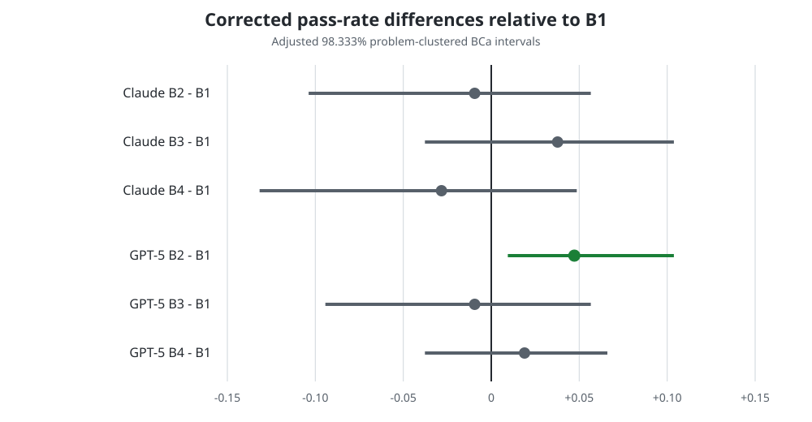

# Case study: cheap escalation signals for code

[Home](../../README.md) / Case studies / Cheap escalation signals

This is an account of my own research project on cheap escalation signals for
code generation, written up here for its methodological lessons. The project
ran privately and its repository stays private; what follows is the design, the
aggregate results, and what I would do differently. It is not a replication
package — no benchmark payloads, model outputs, provider traces, or per-problem
records are published here. See [Provenance](../provenance.md) for exactly what
is and is not included, and why.

> [!IMPORTANT]
> The evidence comes from 120 selected
> [LiveCodeBench](https://github.com/LiveCodeBench/LiveCodeBench) problems. I
> drew three small-model samples per problem with
> [Qwen2.5-Coder 7B](https://huggingface.co/Qwen/Qwen2.5-Coder-7B-Instruct)
> and escalated to the snapshots `claude-sonnet-4-5-20250929` and
> `gpt-5-2025-08-07`. These observations do not predict another cascade's
> performance.

## Question and population

I asked whether cheap signals available *after* a small code model had already
generated an answer could decide when to escalate to a larger reasoning model.
The primary signal families were:

- self-evaluation through an additional confidence-elicitation call;
- syntactic self-consistency across three sampled programs;
- self-critique through an additional pass/fail judgment.

Tests labeled outcomes offline. They were never inputs to the routing signals.

### How the 120 problems were chosen

The population is selected, and the selection rule matters more than the count.
Problems came from LiveCodeBench `release_v6`, whose official repository
documents the version and its April 2025 endpoint. A pilot of 250 candidates
was filtered down to 120 admitted problems by two conditions applied together:

- **the task must be within reach of the large tier** — both larger families
  independently solved it at pass@1 ≥ 1/3 across k=3 samples;
- **the task must not already be solved by the small tier** — the small model
  solved it at pass@1 ≤ 2/3 across k=3 samples.

In that rule **pass@1** is the per-problem mean over the three samples, taking
the values {0, 1/3, 2/3, 1}. The cascade table further down reuses the same name
for a different quantity — the binary outcome of the one answer a policy
actually deployed. Two things sharing a name is a trap worth marking rather than
leaving for the reader to trip over.

That filter deliberately manufactures headroom. It admits only problems where
escalation *could* help, which inflates the apparent value of any cascade
relative to unfiltered traffic. Any escalation-rate or quality number below is
conditional on that.

The 120 were then split into two equal cohorts of 60 by the problem's release
date against an approximate June 2024 working cutoff for Qwen2.5-Coder 7B
([technical report](https://arxiv.org/abs/2409.12186)). The public model
materials do not establish an exact cutoff, so this is a study assumption rather
than a vendor-verified contamination boundary. **Small-clean** problems were
released after it and **small-exposed** problems on or before it, matched on task
format and difficulty. That split exists to answer a question a single pooled
AUROC cannot: whether a signal discriminates because it tracks the model's
competence, or because the model had memorized the problem.

## How it was run

Publishing the numbers without these settings would make several of the results
uninterpretable, so they are part of the finding.

| Setting | Value |
| --- | --- |
| Samples per problem | k = 3 |
| Temperature | 0.7 |
| Top-p | 0.95 |
| Max tokens | 1024 |
| Small tier | Qwen2.5-Coder-7B-Instruct, pinned revision, bfloat16 |
| Small serving | TGI on a dedicated managed inference endpoint, one L4 GPU |
| Large tiers | `claude-sonnet-4-5-20250929`; `gpt-5-2025-08-07` at medium reasoning effort |
| Intervals | 2,000 problem-clustered BCa bootstrap replicates, fixed seed |

Temperature 0.7 is load-bearing rather than incidental. Greedy decoding would
collapse the three samples toward identical text and drive self-consistency to a
constant 1, deleting the signal before it could be measured. A self-consistency
result reported without its sampling temperature cannot be read at all.

### The two elicited prompts

Both signals are one extra call each, with a deliberately narrow parse contract:

```text
self-evaluation:
  "On a scale 0.00-1.00, how confident are you that this code passes
   the unit tests? Reply with only the number."
  parse: float in [0, 1]; on failure record null and escalate

self-critique:
  "Review the code above. Reply with exactly one word: PASS or FAIL."
  parse: exactly PASS or FAIL after uppercase-strip; on failure record
         null and escalate
```

These are the whole signal. Nothing about them is clever, which is the point:
the interesting question was never the prompt, it was whether the resulting
number could carry a routing decision.

### The agreement comparison

Self-consistency scores the fraction of the C(3,2) = 3 unordered sample pairs
whose normalized text matches. Normalization is syntactic only, in this order:

1. replace every `"` with `'`;
2. cut each line from its first `#` to end of line;
3. strip leading and trailing whitespace, and drop blank lines;
4. sort only the contiguous run of `import`/`from` lines at the top of the file.

No parsing, no AST canonicalization, no execution. That exclusion is deliberate:
an execution-equivalence check would consult the test oracle, and a signal that
consults the oracle is not deployable — it is the answer key wearing a
confidence score.

The score can only take the values **{0, 1/3, 1}**. The value 2/3 is
unreachable, because pairwise string equality on three samples is an equivalence
relation: if any two of the three pairs match, the third is forced to match too.
So a nominally continuous-looking agreement score offers a threshold exactly two
usable cut points. See [Preserve the score's
support](../concepts/escalation-signals.md#preserve-the-scores-support).

## Signal quality

Self-evaluation and self-critique were evaluated over 359 usable per-sample
predictions from 120 problems. Of 360 expected values each, both lost exactly one
to malformed output. Self-consistency was evaluated once per problem.

| Signal | Evaluated population | Metric | Estimate | 95% CI |
| --- | --- | --- | ---: | --- |
| Self-evaluation | 359 usable candidates | AUROC | 0.698 | [0.597, 0.792] |
| Syntactic self-consistency | 120 problems: 23 first candidates passed, 97 failed | AUROC | 0.517 | [0.471, 0.614] |
| One-bit self-critic | 70 passing candidates | TPR | 0.871 | [0.754, 0.938] |
| One-bit self-critic | 289 failing candidates | FPR | 0.633 | [0.551, 0.704] |
| One-bit self-critic | 70 passing and 289 failing candidates | Youden J | 0.238 | [0.118, 0.339] |
| One-bit self-critic | 359 usable candidates | Accuracy | 0.465 | [0.397, 0.535] |

The two malformed values were excluded from their metric denominators because
neither supplied a usable value: self-evaluation had no score to rank, the critic
no verdict to classify. Neither event removed a problem from the 120-problem
population, and no routing decision was ever made from them. Under this
playbook's [signal
contract](../concepts/escalation-signals.md#a-practical-signal-contract), such
values would be recorded as malformed and escalated.

The 359 observations remain clustered within 120 independent problems, so the
intervals resample problems rather than pretending each candidate is an
independent task; see [Resample the independent
unit](../concepts/evaluation.md#resample-the-independent-unit).
[`examples/clustered_bootstrap.py`](../../examples/clustered_bootstrap.py)
implements that resampling and shows what ignoring it costs.

### What the metrics are computed over

The figures above are **pooled**: each is computed once over all usable
candidates, and the interval comes from resampling the 120 problems. The
operating point was chosen differently — by leave-one-problem-out
cross-validation, fitting a threshold on the remaining problems and applying it
to the held-out one, producing a per-fold threshold for each problem.

Those two are easy to conflate, and the distinction decides what the gate below
actually tested. The gate was evaluated on the pooled discrimination metric. The
per-fold thresholds existed to drive the cascade arm, which the failed gate
cancelled, so they never produced a routing decision.

### The registered gate, and what missing it looked like

The decision rule was fixed before the outcomes were read:

| Signal kind | Criterion |
| --- | --- |
| Continuous and 3-value | AUROC **lower** confidence bound > 0.600 |
| One-bit | Youden's J **lower** confidence bound > 0.200 |

Against that rule:

| Signal | Bound that mattered | Threshold | Cleared |
| --- | ---: | ---: | --- |
| Self-evaluation | 0.5967 | 0.600 | no, by 0.0033 |
| Syntactic self-consistency | 0.471 | 0.600 | no |
| One-bit self-critic | 0.118 | 0.200 | no |

No signal cleared, so the signal-driven cascade arm was canceled under the stop
rule. Its quality-versus-cost hypothesis was **untestable**, not a negative
result.

Self-evaluation is the instructive row. Its point estimate, 0.698, sits well
above the target; the rule was written about the lower bound, and the lower bound
missed by three thousandths. Had I written the rule after seeing 0.698, I would
almost certainly have called it a success. That gap — between a promising point
estimate and evidence that a threshold will hold up — is the entire reason to
register the rule first.

The self-critic failed differently, and worse. Its confusion matrix was
`tn=106, fp=183, fn=9, tp=61`: it retained 183 of 289 failed attempts. Its
problem was not that it escalated too much, but that it waved through most of the
failures it existed to catch.

Syntactic agreement barely varied: 113 of 120 problems sat at its lowest level,
with a 3-level confusion matrix of `[[82, 10, 21], [3, 0, 2], [2, 0, 0]]`. At
temperature 0.7 the three samples rarely agreed character-for-character even when
they were behaviorally identical. That is a result about the registered syntactic
normalizer, not about semantic-agreement approaches.

### Did the signals survive contamination control?

This is the check I would most want another practitioner to copy. Splitting on
the small model's training cutoff asks whether a signal still works on problems
it cannot have memorized:

| Signal | Metric | Small-clean | Small-exposed | Clean − exposed |
| --- | --- | ---: | ---: | ---: |
| Self-evaluation | AUROC | 0.696 [0.525, 0.832] | 0.702 [0.574, 0.819] | −0.006 [−0.194, +0.183] |
| One-bit self-critic | Youden J | 0.263 [0.071, 0.412] | 0.214 [0.058, 0.344] | +0.049 [−0.164, +0.274] |
| Syntactic self-consistency | AUROC | 0.506 [0.451, 0.654] | 0.529 [0.471, 0.734] | −0.023 [−0.192, +0.086] |

Every clean-minus-exposed interval contains zero and every one of them is wide.
The small model's first-sample pass rate was 12/60 on small-clean and 11/60 on
small-exposed, a difference of +0.017 [−0.131, +0.150]; a supporting release-date
regression gave a slope of −0.003 per month [−0.015, +0.008].

The correct reading is that at this sample size the exposure contrast is
**unresolved**. These numbers do not show that contamination was irrelevant; they
show that a 60-per-cohort design cannot tell. The reusable part is the design,
not the result: if you cannot split your evaluation on the small model's cutoff,
you cannot distinguish a signal from a memorization artifact.

## Cascade reference points

Policy references on the same 120 problems. "Oracle escalation" uses outcome
knowledge and is an upper reference, not a deployable policy. Costs are totals
over that population.

Here **pass@1** is the second of the two senses flagged above: the fraction of
the 120 problems whose *single deployed answer* passed, not the per-problem mean
over three samples. Small-only uses the small model's first candidate; big-only one
larger-model answer; oracle escalation retains a passing first small candidate and
otherwise takes the larger answer. In this table **escalation rate** means the
fraction of problems answered by the larger model, so big-only is 1.000. The
playbook's [offline evaluator](../concepts/evaluation.md) instead counts
transitions after a small attempt, giving its big-only policy a rate of zero.

| Strategy | Larger family | n problems | pass@1 [95% CI] | Escalation rate | Total variable API cost |
| --- | --- | ---: | --- | ---: | ---: |
| Small only | — | 120 | 0.192 [0.125, 0.258] | 0.000 | $0.00 |
| Big only | Claude | 120 | 0.875 [0.800, 0.917] | 1.000 | $16.52 |
| Oracle escalation | Claude | 120 | 0.875 [0.800, 0.917] | 0.808 | $14.43 |
| Big only | GPT-5 | 120 | 0.975 [0.917, 0.992] | 1.000 | $10.40 |
| Oracle escalation | GPT-5 | 120 | 0.975 [0.917, 0.992] | 0.808 | $9.49 |
| Signal driven | — | 120 planned | canceled | — | not spent |

The small-only row has no variable API spend because the small endpoint was
billed by uptime rather than by request. Its shared uptime cost was $6.44, so the
$0.00 does not mean the small tier was free to operate. Because no signal cleared
the gate, signal-driven cascade utility was unobserved and remains untestable
rather than negative.

## Signals consume resources

Routing evidence has its own cost and latency budget. Per-problem averages over
the 120 problems:

| Signal | Extra calls/problem | Extra tokens/problem | Extra wall-clock seconds/problem |
| --- | ---: | ---: | ---: |
| Self-evaluation | 3 | 1,939 | 1.397 |
| Self-critic | 3 | 1,879 | 0.685 |
| Self-consistency | 0 beyond the existing `k=3` | 0 | 0.000 |

Three extra calls per problem is one call per sampled candidate, at k=3. The
self-consistency row is zero only *after* three generations already exist;
comparing that conditional zero against a signal that starts from one candidate
would be misleading. A routing policy has to repay the resources that produced its
signal, not only the calls made after escalation.

## Corrected failure-context evidence

A separate arm asked whether giving the larger model the failed code or an
execution trace helped. A later audit found that the original conditions did not
all receive the same task-format instructions: code-bearing conditions also
exposed format scaffolding, so the apparent treatment effect was confounded with
scaffold restoration.

I withdrew that interpretation and ran a prospectively defined correction. Its
rules were settled before its own outcomes, but it does not count as a separately
conceived repeat. The corrected population was the 106 of the same 120 problems
where the small tier produced at least one failed candidate. Every cell used all
106.

These values are pass rates: passing larger-model answers divided by the 106
failure-selected problems in that family-condition cell.

| Larger family | n per cell | B1: problem only | B2: failed code | B3: trace | B4: code + trace |
| --- | ---: | ---: | ---: | ---: | ---: |
| Claude | 106 | 0.8585 | 0.8491 | 0.8962 | 0.8302 |
| GPT-5 | 106 | 0.9434 | 0.9906 | 0.9340 | 0.9623 |

The corrected gate compared each condition with B1 using 2,000 problem-clustered
BCa replicates and Bonferroni-adjusted intervals. Each family had three planned
comparisons against B1, so dividing the 0.05 familywise budget by three gives
0.01667 per comparison and each two-sided interval covers
`1 - 0.05 / 3 = 0.98333`, or 98.333%.

| Larger family | Paired n | Contrast | Pass-rate delta | Adjusted 98.333% CI |
| --- | ---: | --- | ---: | --- |
| Claude | 106 | B2 - B1 | -0.0094 | [-0.1038, +0.0566] |
| Claude | 106 | B3 - B1 | +0.0377 | [-0.0377, +0.1038] |
| Claude | 106 | B4 - B1 | -0.0283 | [-0.1317, +0.0486] |
| GPT-5 | 106 | B2 - B1 | **+0.0472** | **[+0.0094, +0.1038]** |
| GPT-5 | 106 | B3 - B1 | -0.0094 | [-0.0943, +0.0566] |
| GPT-5 | 106 | B4 - B1 | +0.0189 | [-0.0377, +0.0660] |

Only GPT-5 receiving failed code cleared the corrected gate. No adjusted interval
demonstrated a benefit for Claude or for either trace-containing condition. Where
an interval spans zero, the direction is unresolved; that demonstrates neither
parity nor damage.



The figure is recreated from the aggregate contrasts above; its provenance is
recorded in [Provenance](../provenance.md).

## What the cost accounting actually cost me

The playbook's advice to separate fixed from variable cost comes from getting it
wrong here, in a way worth describing concretely.

I budgeted the small endpoint at $0.80/hour × 4 hours = $3.20, reasoning that the
small generation session needed four hours. But the design deliberately holds the
endpoint open *across* the large-model arms, because signal extraction runs after
the large-tier baseline is produced. The budget priced a window the experiment
could not actually use. Realized uptime was 7.78 hours against a 4-hour ceiling.

Two further things went wrong at once. The teardown path used an already-expired
lifecycle deadline and masked the first error, so the breach was not surfaced when
it happened. And the run generated its complete sample bank and then aborted before
signal extraction, because the signal path tried to price a per-hour endpoint
per-call. A later salvage invocation replayed the committed draws read-only and
produced the analysis tail — which preserves the estimand but permanently splits
generation and analysis across two invocations.

The final fixed charge was $6.24 for the 7.78-hour session plus $0.20 for the
salvage session: the $6.44 that appears above. The per-call price of the small
tier was, correctly, zero throughout.

Three transferable points. A per-hour resource is not priced by the work you
think it is doing, but by the wall-clock window your orchestration actually holds
it open. A cost model that assumes one billing shape will fail loudly when it
meets another. And an incident that changes how results were produced belongs in
the write-up, because it changes what a reader can verify.

## Boundaries on interpretation

- The results are conditional on the selected 120-problem population, the
  headroom filter that created it, `k=3`, one fixed small-model revision, and the
  exact larger-model snapshots.
- The exposure-cohort contrasts are unresolved at 60 per cohort, not null.
- Because the failure-context population is selected on observed small-tier
  failure, its contrasts do not measure the whole cascade's quality-cost
  trade-off.
- Hosted model responses vary across calls. Seeds used for resampling do not make
  provider outputs repeat byte-for-byte.
- The original failure-context interpretation was withdrawn because task-format
  instructions were omitted and failure context was confounded with scaffold
  restoration. The rerun was governed before its outputs were seen, yet it remains
  a correction rather than a separate repeat.

## Reusable lessons

1. **Freeze the decision rule before reading outcomes.** A point estimate above a
   target is not enough when the registered rule concerns the uncertainty around
   that estimate. Three thousandths is the difference between a result and a story.
2. **Keep signal polarity explicit.** "Positive" meant retain, so a false positive
   was a failed answer allowed through.
3. **Publish the decoding settings with the signal.** A consistency result without
   its sampling temperature is unreadable.
4. **Split on the small model's training cutoff.** Otherwise a memorization
   artifact and a usable signal look identical.
5. **Give every condition the same task contract.** Formatting information acts
   like a treatment when only some prompts contain it.
6. **Separate unknown from negative.** A canceled or unrun arm does not show that
   the tested effect is absent.
7. **Include fixed and marginal costs.** An endpoint billed by uptime is not free
   because its per-call field is zero, and the uptime you pay for is the window
   your orchestration holds open.
8. **Preserve incident provenance.** Timeouts, retries, settled failures, and lost
   artifacts change what later readers can verify.

## Scope

This slice leaves several environments unanswered: the full benchmark
distribution, especially difficult tasks, live production requests, multi-file
changes, agent workflows, non-Python work, and routers that choose a tier before
generation.

See [Provenance](../provenance.md) for what is published and what is not, and
[Limitations](../limitations.md) before applying these lessons.

Previous: [Should you cascade?](../decision-checklist.md)

Next: [Limitations](../limitations.md)
